# Build-a-AWS-Virtual-Private-Cloud-VPC

## Overview
This project demonstrates how to build a Virtual Private Cloud (VPC) on Amazon Web Services (AWS). 
A VPC is a virtual network that allows you to launch AWS resources in a logically isolated section of the AWS cloud. 
It provides control over your network configuration, including IP address ranges, subnets, route tables, and network gateways.

## Services Used
- Amazon VPC
- Subnets
- Route Tables
- Internet Gateway
- Security Groups
- Network Access Control Lists (NACLs)
- EC2 Instances
- Load Balancers
- NAT Gateways

## Architecture
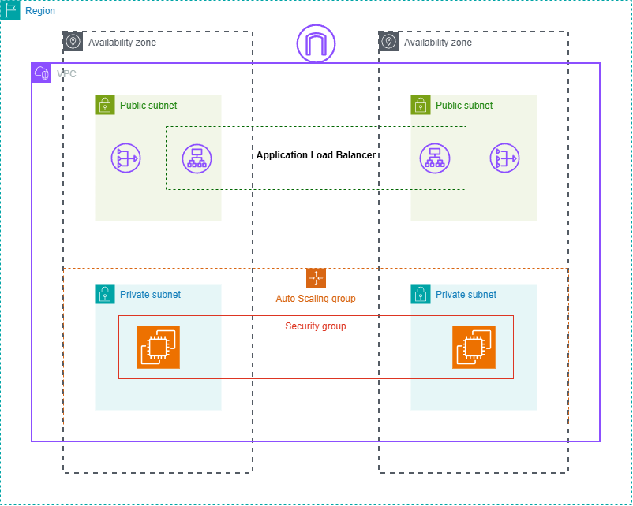

## Steps

1. Create a VPC
- create a new VPC with a specified CIDR block (e.g., 10.0.0.0/16).
- Create 1 public subnet and 1 private subnet in different availability zones "us-east-1a" and "us-east-1b".
- Create an Internet Gateway and attach it to the VPC.
- Create a Route Table and associate it with the public subnet and 2 Route Table one each for the private subnets.
- Create a NAT Gateway in the public subnet to allow instances in the private subnet to access the internet.

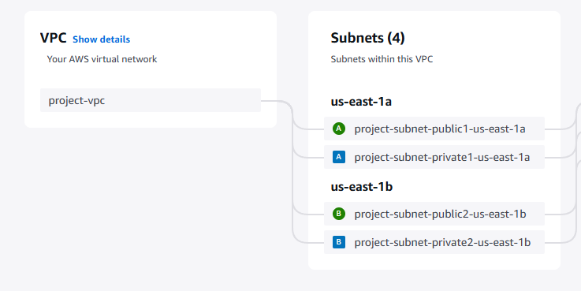
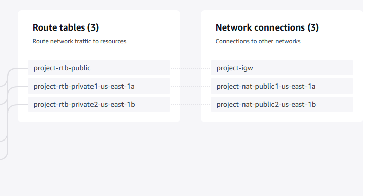

 
2. Create auto scaling group
- Launch template configuration for the EC2 instances in the private subnet.
- create a security group for the EC2 instances to allow inbound traffic on port 8000 (HTTP) and port 22 (SSH).

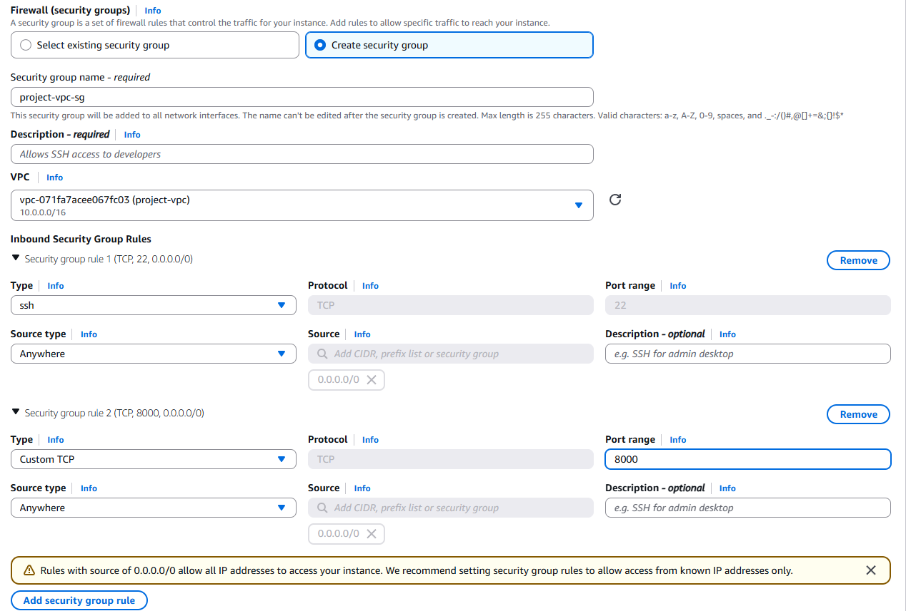

- Create an Auto Scaling Group (ASG) with  a desired capacity of 2 instances with a minimum of 2 instances and a maximum of 4 instances.

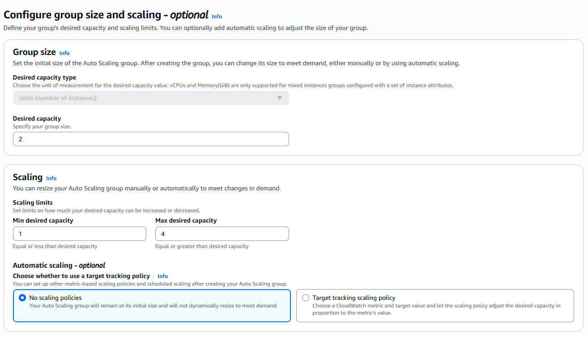

- One instance will be launched in the us-east-1a availability zone and the other instance will be launched in the us-east-1b availability zone.

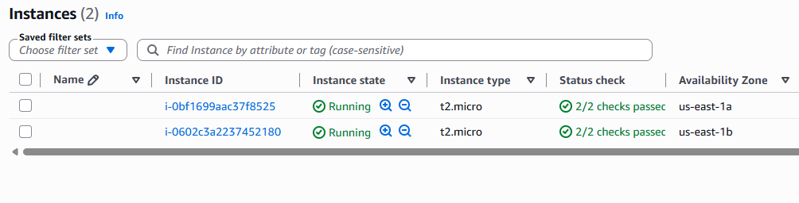


3. Create bastion host
- Now create a bastion host instances in the public subnet to allow SSH access to the instances in the private subnet. 
- In "Network settings" section, select the right VPC and public subnet, and assign (enable Auto-assign public IP) a public IP address to the bastion host instance.
- Create a security group for the bastion host instance to allow inbound SSH traffic.

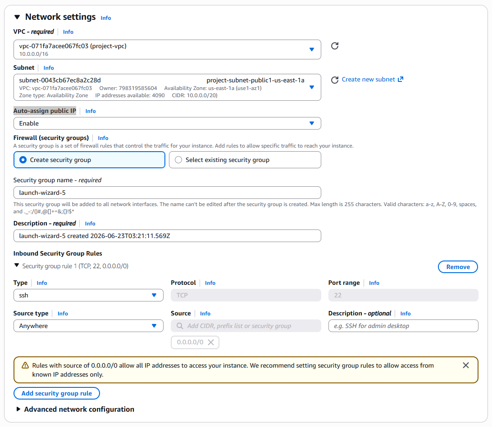


4. Connect to the bastion host instance

```bash
You can use the following command to connect to the bastion host instance using SSH:
ssh -i /path/to/your-key.pem username@bastion-public-ip

You can use the following command to copy files like key name pair from your local machine to the bastion host instance using SCP:
scp -i /path/to/your-key.pem /path/to/local/file.txt username@ec2-public-ip:/path/to/remote/directory/

```

5. Connect to the private instances

```bash
Once you are connected to the bastion host instance, you can use the following command to connect to the private instances using SSH:
ssh -i /path/to/your-key.pem username@private-private-ip    
```

6. Test the setup
- You can test the setup by accessing the private instances through the bastion host and verifying that they can reach the internet through the NAT Gateway.

7. Create a Load Balancer
- Create an Application Load Balancer (ALB) in the public subnet to distribute incoming traffic
- Create a target group and register the private instances with the target group.

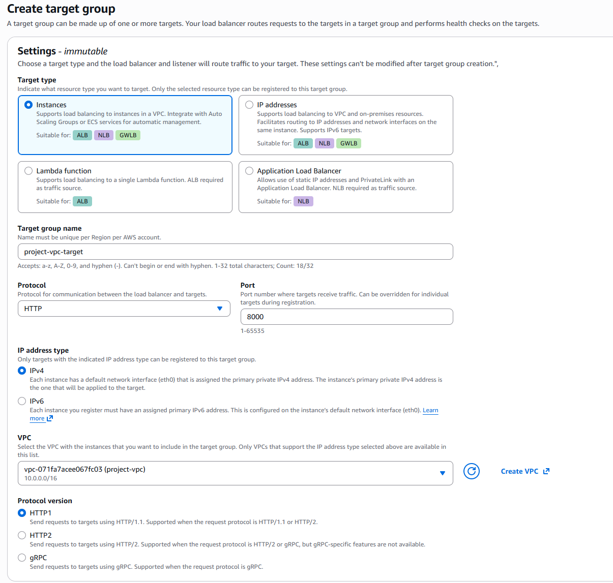

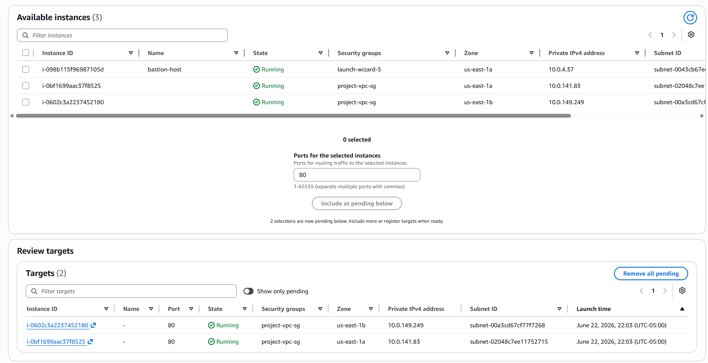

- Create a listener for the ALB to listen on port 8000 (HTTP) and forward traffic to the target group.

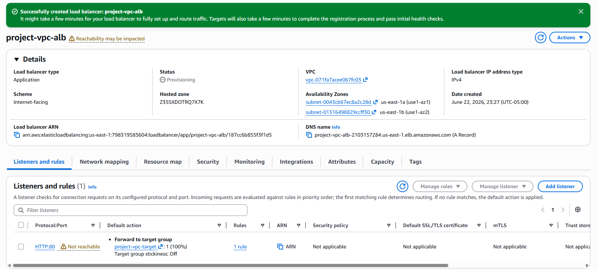

- Go to Settings and open the security group for the load balancer and allow inbound traffic on port 8000 (HTTP).

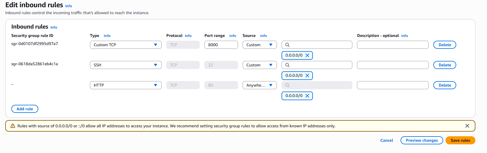

## Lessons Learned
- Understanding the components of a VPC and how they interact with each other.
- Learning how to create and configure subnets, route tables, and internet gateways.
- Gaining experience with security groups and NACLs to control inbound and outbound traffic.
- Learning how to set up a bastion host for secure access to private instances.
- Understanding how to create and configure an Auto Scaling Group to manage EC2 instances.

## Conclusion
Setting up a VPC on AWS provides a secure and scalable environment for deploying applications. By following the steps outlined in this project, you can create a VPC with public and private subnets, configure routing and security, and deploy EC2 instances with load balancing and auto-scaling capabilities. This project serves as a foundation for building more complex architectures on AWS.